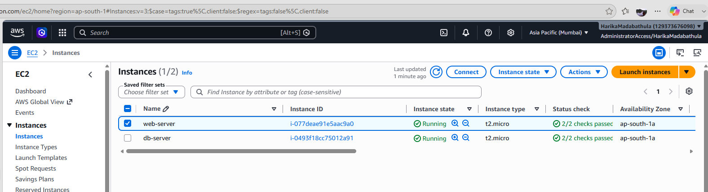
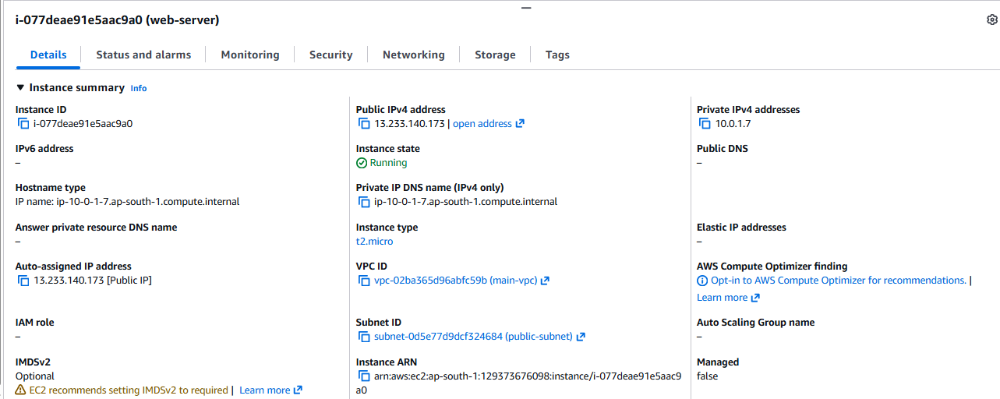
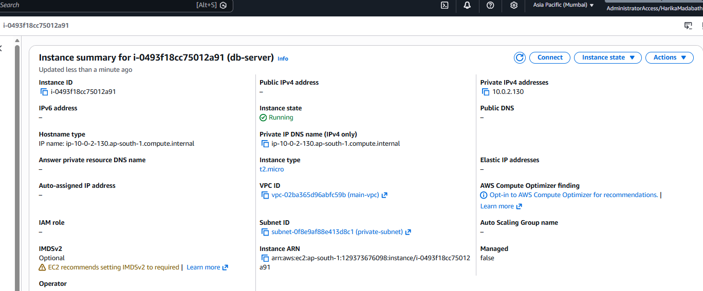
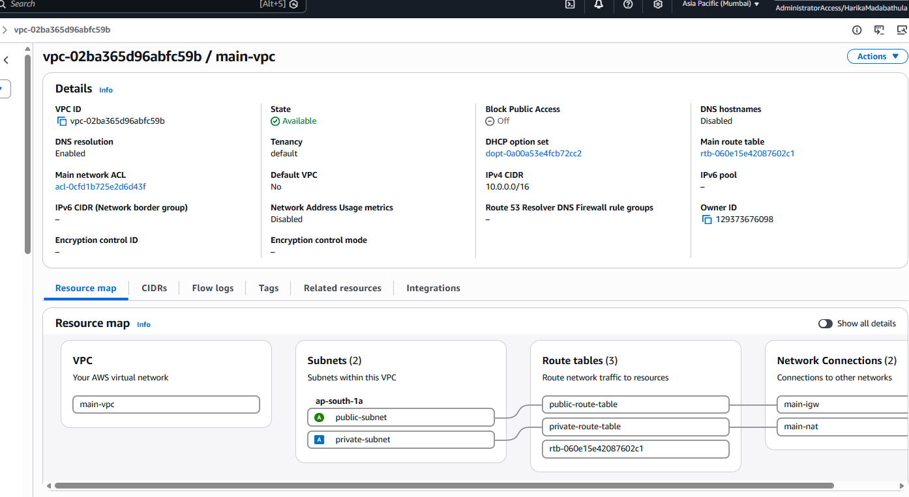
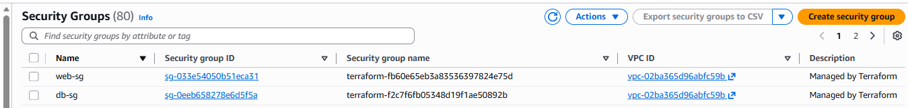
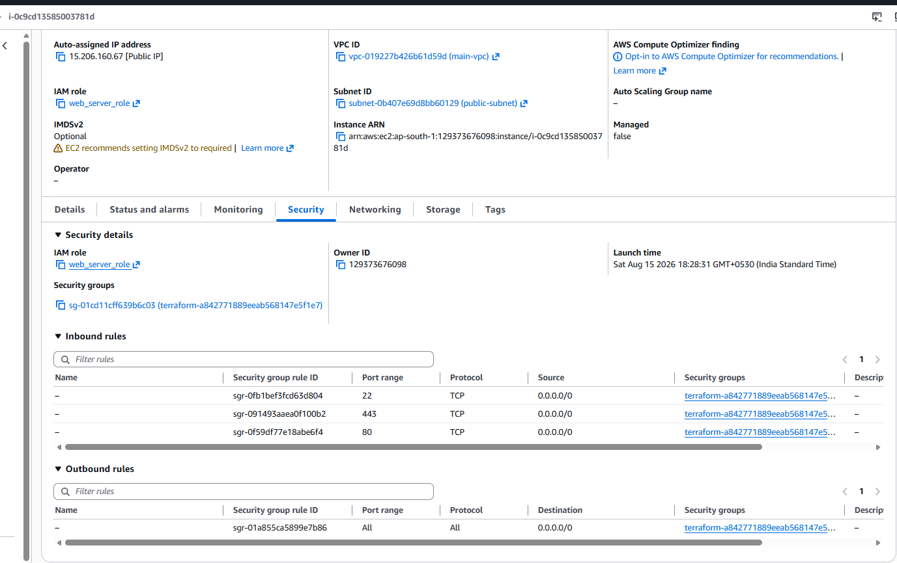
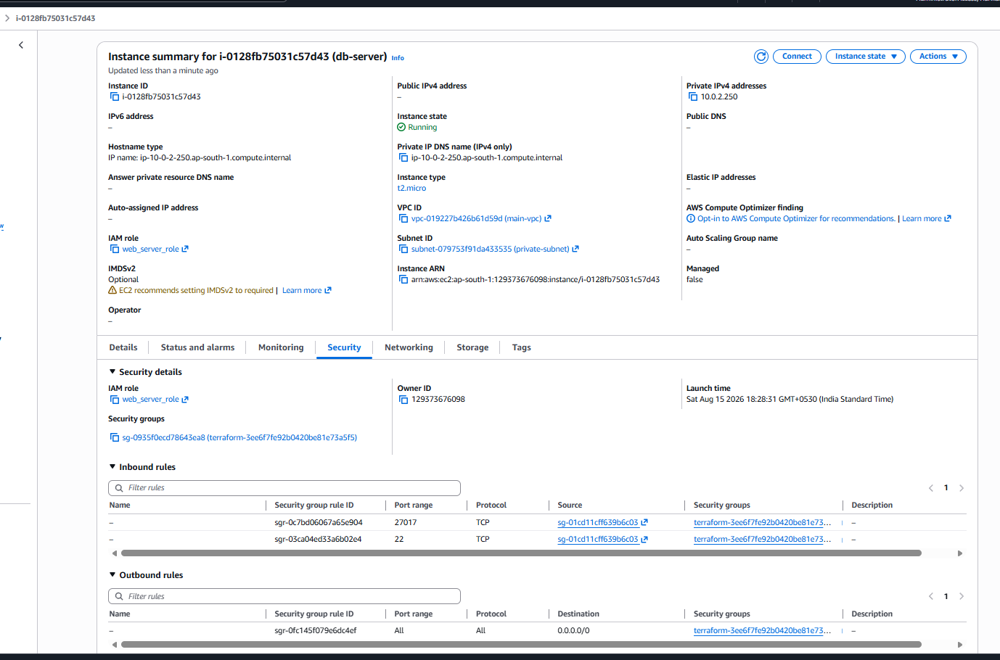
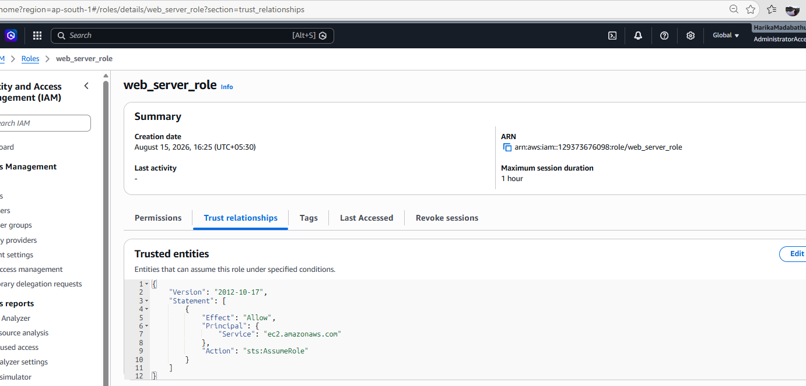
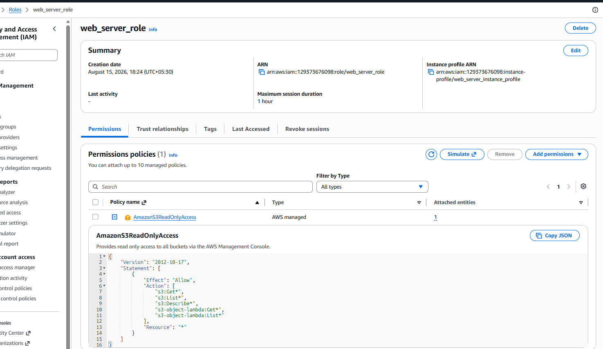
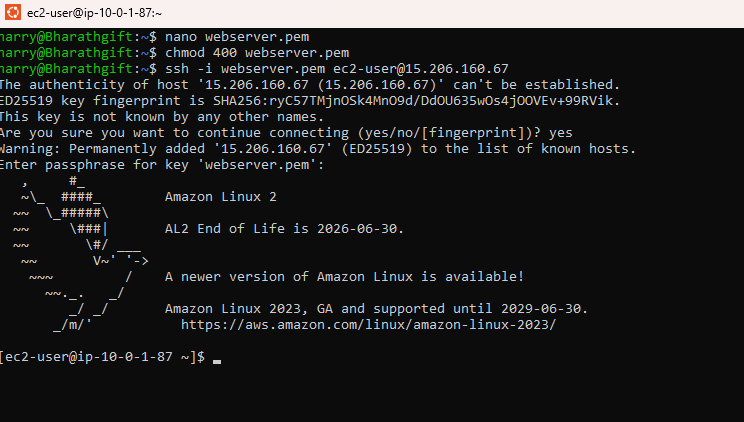

# Instances 2 created
> 

# web server - Public IP
> 

# db server - Private IP
> 

# VPC - Subnet - Route Table - Gateway and NAT
> 

# Security Groups
> 

# webserver SG
> 

# DB SG
> 

# IAM Role
> 

> 

# EC2 instance - web server - public IP
> 


# OUTPUT

```
Outputs:

db_server_instance_ids = [
  [
    "i-0128fb75031c57d43",
  ],
]
iam_role_arn = "arn:aws:iam::129373676098:role/web_server_role"
iam_role_name = "web_server_role"
private_subnet_id = "subnet-079753f91da433535"
public_subnet_id = "subnet-0b407e69d8bb60129"
security_group_db_id = "sg-0935f0ecd78643ea8"
security_group_id = "sg-01cd11cff639b6c03"
vpc_id = "vpc-019227b426b61d59d"
web_server_instance_ids = [
  [
    "i-0c9cd13585003781d",
  ],
]
web_server_public_ip = [
  [
    "15.206.160.67",
  ],
]

```