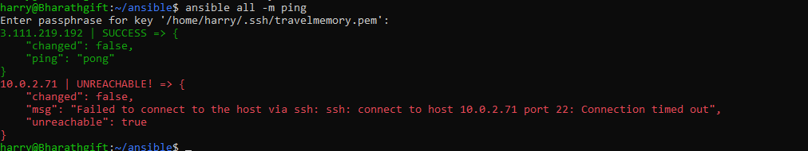
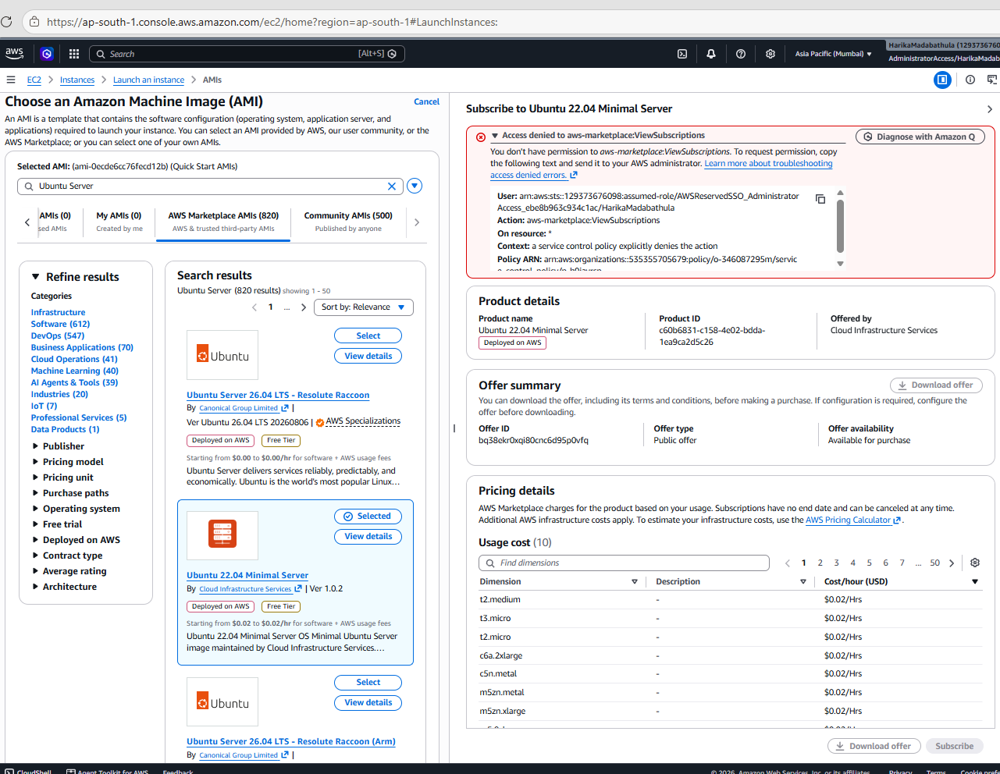

## Ansible Travel Memory setup from Terraform VM creation

## vaults password

> 

> 

> 

> 

> 

> 

> 

> 

---
## Bottlenecks

## Ansible Public IP connect
> 

## Resolute

> 

## ubuntu 22.04 or 24.04
> 