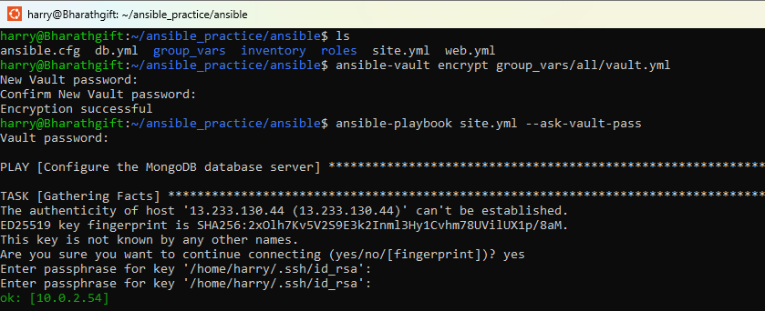
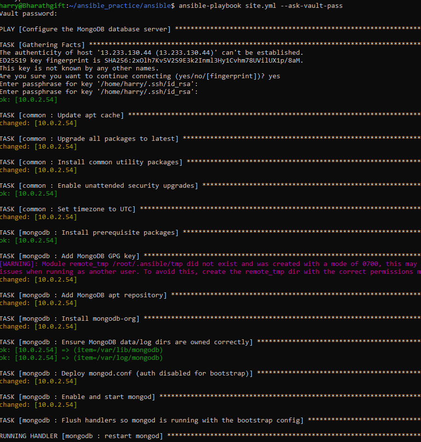
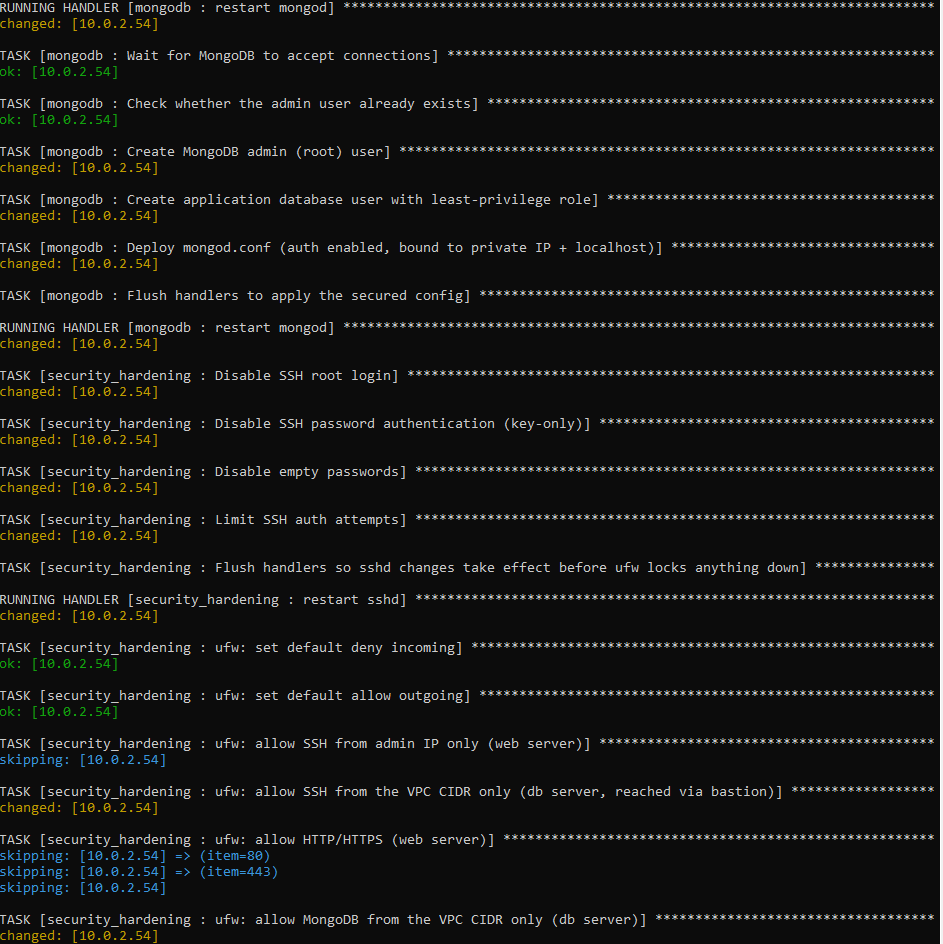
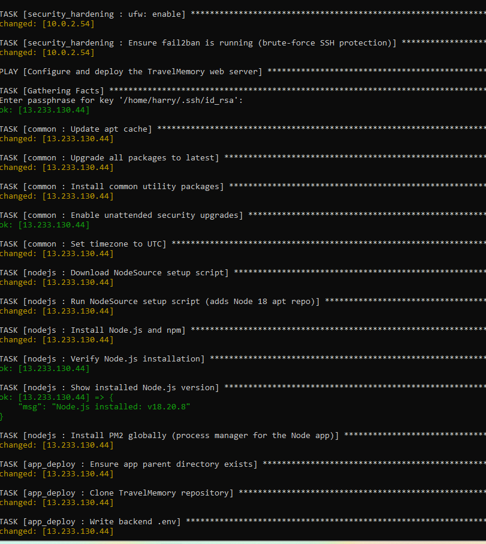
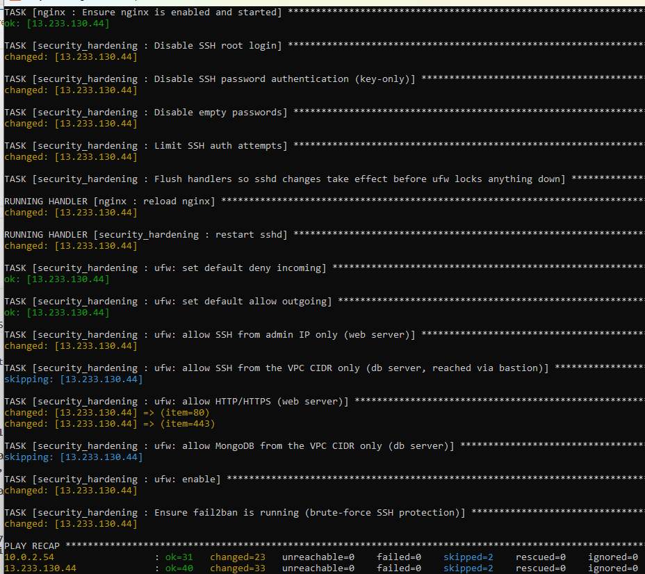
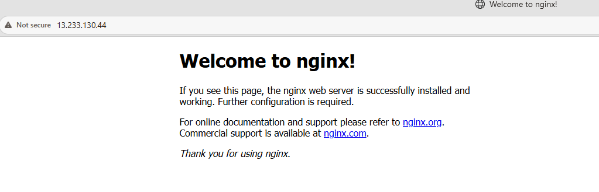
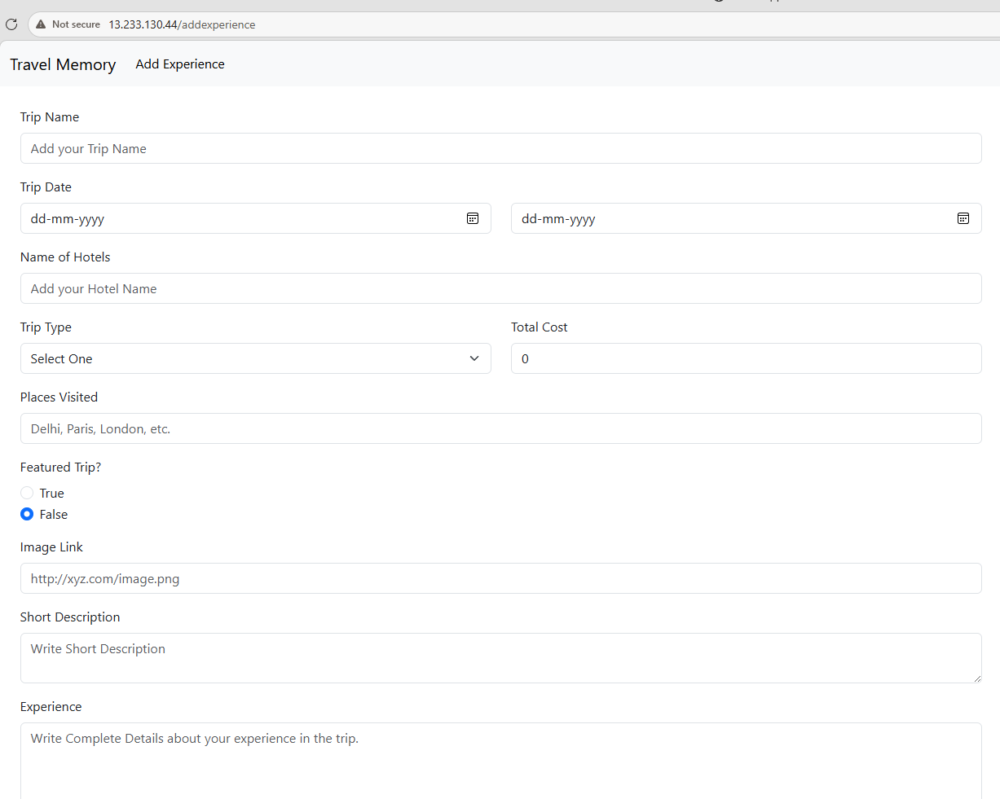
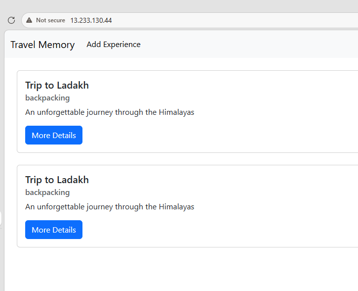

## Ansible Travel Memory setup from Terraform VM creation

## vaults password

> 

## playbook trigger

> 

## dbserver completion

> 

## webserver setup

> 

## webserver completion

> 

## Nginx Installation

> 

## Travel Memory application 

> 

## Travel Memory DB communicating with frontend configuration confirmation

> 
