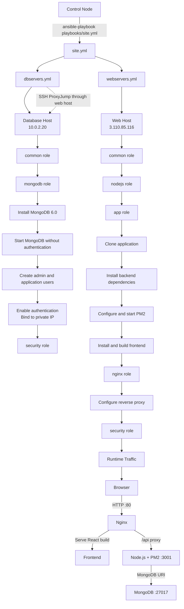

## Ansible Terminal commands

```
ansible-vault encrypt inventory/group_vars/vaults.yml
ansible-inventory -i inventory/hosts.ini --list --ask-vault-pass
ansible-playbook -i inventory/hosts.ini playbooks/site.yml --ask-vault-pass
```

## Folder Structure

```
├───ansible
│   ├───inventory
│   │   └───group_vars
│   ├───playbooks
│       ├───dbservers.yml
│       ├───site.yml
│       ├───webservers.yml
│   └───roles
│       ├───app
│       │   ├───tasks
│       │   └───templates
│       ├───common
│       │   └───tasks
│       ├───mongodb
│       │   ├───handlers
│       │   ├───tasks
│       │   └───templates
│       ├───nginx
│       │   ├───handlers
│       │   ├───tasks
│       │   └───templates
│       ├───nodejs
│       │   └───tasks
│       └───security
│           ├───handlers
│           └───tasks
└───Screenshots

```

## Screenshot of Trigger

[Screenshots taken while execution and validating the browser](https://github.com/Harika130822/HV_ASSIGN_Terraform_Ansible/blob/main/02_ConfigurationDeploymentAnsible/Screenshots/readme.md)


## Execution Output

[Execution Output](https://github.com/Harika130822/HV_ASSIGN_Terraform_Ansible/blob/main/02_ConfigurationDeploymentAnsible/ansible_ubuntu_execution_output.txt)

## validation outputs

> 

## Ansible Architecture Execution Flow



## Execution Order

1. `site.yml` imports `dbservers.yml`.
2. The database host runs `common`, `mongodb`, and `security`.
3. `site.yml` imports `webservers.yml`.
4. The web host runs `common`, `nodejs`, `app`, `nginx`, and `security`.
5. Nginx serves the frontend and proxies `/api` requests to the PM2-managed backend.
6. The backend connects to MongoDB through the database host's private IP.


